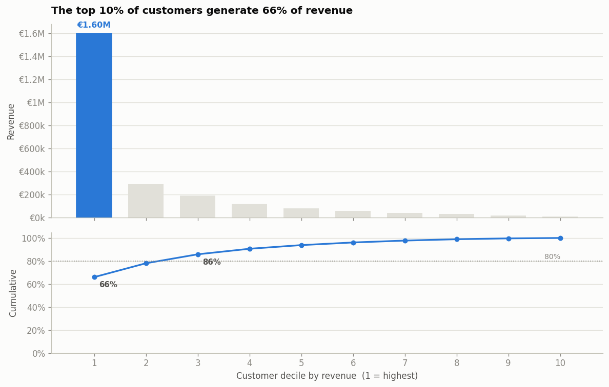

# Retail Revenue & Retention Analytics

**SQL · Power BI · Python**

An end-to-end analytics project on a European retailer's transaction data: a 7-table
star schema in SQL, cohort and RFM analysis, and a Power BI dashboard built to answer
two questions the business kept arguing about —

1. **Where does revenue leak away?** (returns, cancellations, discounting)
2. **Which customers are actually worth keeping?** (concentration, cohorts, churn)

### 👉 Start here: [`notebooks/retail_analytics.ipynb`](notebooks/retail_analytics.ipynb)

The full analysis, start to finish, with every chart and table already run — profiling
the raw file, cleaning it, the scope decisions and why I made them, then the five
findings. It renders directly in GitHub, so there is nothing to install to read it.



---

## Headline results

Measured on the real dataset (see [Data](#data) below):

| | |
|---|---|
| Transactions analysed | **62,316** |
| Total revenue | **€2,428,192** |
| Profit margin | **20.0%** *(modelled — see the honesty note)* |
| Orders | 3,280 |
| Customers | 508 |
| Period | Dec 2009 – Nov 2011 (24 complete months) |
| Revenue lost to returns | €58,192 |

**The three findings that mattered:**

- **Revenue is extremely concentrated.** The top 10% of customers generate **65.7%** of
  revenue; the top 30% generate **85.7%**. The bottom half of the customer base is
  worth about 6% of revenue put together.
- **One-time buyers are almost worthless in aggregate.** 29.7% of customers bought
  exactly once, and they account for just **4.7%** of revenue. Repeat buyers are 70.3%
  of customers but **95.3%** of revenue.
- **Retention collapses after the first month, then stabilises.** Month-1 retention is
  **20.9%**, and it flattens out around 20–24% rather than continuing to decay — the
  customers who survive the first month tend to stay. That makes the first 30 days the
  single highest-leverage window for intervention.

RFM segmentation put numbers on the same story: **108 "Champions" (21.3% of customers)
drive 72.6% of revenue**, while 13 high-value customers had gone quiet for 6+ months and were exported as a win-back list.

---

## Honesty note — what is measured and what is modelled

I would rather state this up front than have someone find it later.

| Figure | Status |
|---|---|
| Transaction count, revenue, orders, customers | **Measured** from the real data |
| Customer concentration, cohorts, retention, RFM | **Measured** |
| Returns / revenue leakage | **Measured** |
| **Profit margin (~20%)** | **Modelled.** The source file has a selling price but no cost column, so profit cannot be measured from it. I apply a documented per-category cost model, scaled so the blended margin is 20%. The *relative* margin differences between categories are my judgement; the *level* is an assumption. |
| Currency (EUR) | The retailer invoices in GBP. Converted at a fixed rate of 1.15, not daily rates. |

Everything in the cost model lives in `CATEGORY_RULES` in
[`python/clean_online_retail.py`](python/clean_online_retail.py) — it is about
20 lines and easy to change.

---

## Data

The project runs on **either of two sources**, and they load into the same 7 tables, so
every SQL query, DAX measure and dashboard page works unchanged against both.

### A. Real data — UCI "Online Retail II"

Real transactions from a UK-based online giftware retailer, Dec 2009 – Dec 2011.
Free, no login: <https://archive.ics.uci.edu/dataset/502/online+retail+ii>

Download `online_retail_II.xlsx` into `data_raw/`, then:

```bash
python python/clean_online_retail.py --profile   # report what is wrong with the file
python python/clean_online_retail.py             # clean it and build the 7 tables
```

**What the raw file looks like before cleaning** — this is the real output of
`--profile`, not an estimate:

```
 Total rows                          :    1,067,371
 Exact duplicate rows                :       34,335  ( 3.22%)
 Rows with no Customer ID            :      243,007  (22.77%)
 Cancellation invoices (start 'C')   :       19,494  ( 1.83%)
 Quantity <= 0                       :       22,950  ( 2.15%)
 Price <= 0                          :        6,207  ( 0.58%)
 Non-product codes (POST, DOT, M...) :        5,911  ( 0.55%)
```

**Scope decisions.** Three, each made after looking at the data and each logged:

1. **Excluded the UK.** It is 91% of rows and €16.0M of the €19.2M total. The export
   business is a segment the company would report separately, and it is where retention
   is genuinely a question.
2. **Excluded EIRE.** Three accounts generated €674,618 — 21.5% of all export revenue
   from 3 customers out of 518. That is a wholesale relationship, not export retail
   behaviour, and leaving it in would dominate every customer-level metric.
3. **Complete months only.** The file stops mid-month on 2011-12-09, so December 2011
   is partial and would make the last point of every trend line collapse for no real
   reason. Scope ends 2011-11-30.

The cleaner prints a full audit trail:

```
 Step                                             Removed     Remaining
 Raw rows loaded                                              1,067,371
 Dropped exact duplicate rows                      34,335     1,033,036
 Split out cancellation invoices ('C')             19,104     1,013,932
 Dropped rows with no Customer ID                 234,437       779,495
 Dropped non-product stock codes                    2,858       776,637
 Dropped Price <= 0                                    60       776,577
 Dropped Quantity > 2,000                             116       776,461
 Excluded home market (United Kingdom)            699,544        76,917
 Excluded wholesale market (EIRE)                  15,349        61,568
 Trimmed partial final month                        1,135        60,433
 Added cleaned return lines back in                -2,017        62,450
 Consolidated repeated lines within an invoice        134        62,316
```

The raw file has no category, no cost, no brand and no signup date. The cleaner derives
a **category** from the free-text description with a keyword classifier (11 categories),
models **cost**, and uses each customer's **first purchase date** as their signup date
for cohort analysis.

### B. Synthetic data

`python/generate_data.py` writes the same 7 tables with no download required. It is
seeded, so it produces identical output every run. Useful for checking out the repo and
having something to look at in 5 seconds.

```
 Order items (transactions):       62,463
 Total revenue (completed) : EUR    2,410,425
 Profit margin             :            20.2 %
 Top 30% customers revenue :            61.3 %
 Repeat customers          :        7,613  (59.6%)
```

Note this dataset is **modelled retail-consumer behaviour** (AOV €98), whereas the real
export dataset is **wholesale behaviour** (AOV €920). Their concentration figures differ
a lot for that reason, and that contrast is itself worth talking about.

---

## The schema

Seven tables, star schema, in [`sql/01_schema.sql`](sql/01_schema.sql).

```
                    dim_categories
                          |
   dim_date          dim_products        dim_stores
       \                  |                 /
        \                 |                /
         +---------- fact_orders ---------+
                    /            \
          dim_customers      fact_order_items
```

| Table | Grain | Rows (real / synthetic) |
|---|---|---|
| `dim_date` | one day | 730 / 731 |
| `dim_customers` | one customer | 508 / 13,000 |
| `dim_categories` | one category | 11 / 8 |
| `dim_products` | one product | 3,383 / 321 |
| `dim_stores` | one market or store | 39 / 6 |
| `fact_orders` | one order | 3,280 / 25,635 |
| `fact_order_items` | **one product line in an order** | **62,316 / 62,463** |

`fact_order_items` is the analysis grain — that is the "transactions" figure.

Two notes on modelling choices:

- **`dim_categories` is snowflaked off `dim_products`** rather than flattened into it,
  so department-level reporting does not repeat the department name on 3,383 rows.
- **`dim_stores` holds markets in the real dataset.** That retailer is online-only, so
  there are no physical stores; the closest real equivalent is the destination country.
  Keeping the table name means every query and measure works against both datasets.
  Named honestly here rather than pretending there are shops.

Derived amounts (`line_revenue`, `line_cost`, `line_profit`) are **stored, not
recomputed**. That is deliberate redundancy: it makes every downstream query simpler and
faster, and `sql/03_data_quality_checks.sql` verifies the arithmetic stays consistent.

**One rule runs through the whole project:** revenue only counts when
`order_status = 'Completed'`. Returned and cancelled orders are measured separately as
leakage. My first version of the dashboard reported €2.49M because it was quietly
counting returns.

---

## Running it

```bash
# 1. Build a dataset (pick one)
python python/generate_data.py                  # synthetic
python python/clean_online_retail.py            # real (needs the xlsx in data_raw/)

# 2. Check the SQL layer runs and the numbers are right
python python/verify_sql.py                     # against synthetic
python python/verify_sql.py --real              # against the cleaned real data

# 3. Load into PostgreSQL (optional - Power BI can read the CSVs directly)
psql -d retail_analytics -f sql/01_schema.sql
psql -d retail_analytics -f sql/02_load_data.sql
psql -d retail_analytics -f sql/03_data_quality_checks.sql

# 4. Build the report
#    open powerbi/RetailAnalytics.pbip, or follow powerbi/DASHBOARD_GUIDE.md
```

Only `pandas` and `openpyxl` are needed, and only for the real-data path — the
generator and the SQL verifier use the standard library alone.

### `verify_sql.py`

Loads a dataset into in-memory SQLite and executes **every** query in `sql/`, printing
the results. It runs in about two seconds, and I run it after any change to a query or
to the data.

This is not decoration — it caught two real bugs:

1. **The average retention curve was silently wrong.** Joining the cohort-size table
   back onto per-customer activity rows repeated each cohort total once per active
   customer, so `customers_at_risk` came out as 8,270,475 and every retention figure
   read as 0.2%. Fixed by collapsing to one row per (cohort, month_index) first — the
   comment in `sql/05_cohort_retention.sql` explains it.
2. **128 invoices in the real data listed the same product on more than one line**,
   which broke the one-line-per-product grain. The cleaner now consolidates them,
   summing quantity and taking the revenue-weighted average price so the invoice total
   is unchanged.

---

## Files

```
notebooks/
  retail_analytics.ipynb        the whole analysis, executed - start here
screenshots/                    the 7 charts, exported as PNG
sql/
  01_schema.sql                 7-table star schema, indexes, constraints
  02_load_data.sql              CSV load (+ MySQL and SQL Server variants)
  03_data_quality_checks.sql    10 checks; the first 9 must return zero rows
  04_revenue_analysis.sql       KPIs, trend, category/store performance, leakage
  05_cohort_retention.sql       cohort matrix, retention curve, repeat behaviour
  06_rfm_segmentation.sql       RFM scoring, 8 segments, win-back list
  07_pareto_top_customers.sql   concentration, deciles, top-30% profiling
python/
  generate_data.py              synthetic dataset generator (stdlib only)
  clean_online_retail.py        real UCI data -> the same 7 tables
  verify_sql.py                 runs every SQL file against SQLite
  build_pbip.py                 generates the Power BI project from measures.dax
  validate_pbip.py              checks every DAX reference resolves
  build_notebook.py             generates and executes the notebook
powerbi/
  measures.dax                  every measure and calculated column, commented
  DASHBOARD_GUIDE.md            page-by-page report design and build notes
  RetailAnalytics.pbip          pre-built model - open this in Power BI Desktop
  RetailAnalytics.SemanticModel/  model.bim: tables, relationships, 35 measures
  RetailAnalytics.Report/         4 empty named pages
data/                           synthetic CSVs (generated)
data_real/                      cleaned real CSVs (generated)
data_raw/                       put online_retail_II.xlsx here
```

---

## What I would do differently

- **The Pareto visual does not scale.** With 500+ customers on the X axis it is slow and
  unreadable. Binning into percentiles works, but a proper solution would precompute the
  curve in SQL and load 100 rows instead of 500.
- **The cost model is the weak point.** If I did this again I would look for a dataset
  with real costs, even if it meant smaller revenue numbers, because "modelled margin"
  is a caveat I have to explain every time.
- **508 customers is thin for cohort analysis.** Median cohort size is 20, so individual
  cells in the retention matrix are noisy. The UK segment has 5,334 customers and much
  smoother cohorts — the trade-off was scope realism against sample size, and I would
  probably run both next time.
- **No incremental refresh.** Everything reloads from scratch. Fine at 62k rows,
  wrong at 62M.

